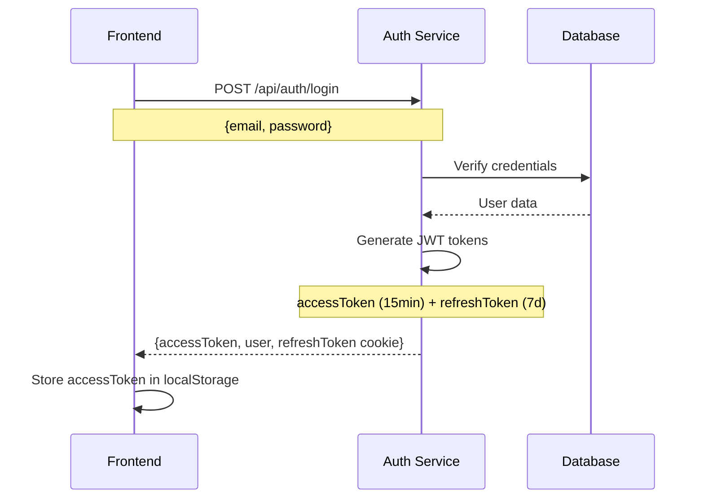
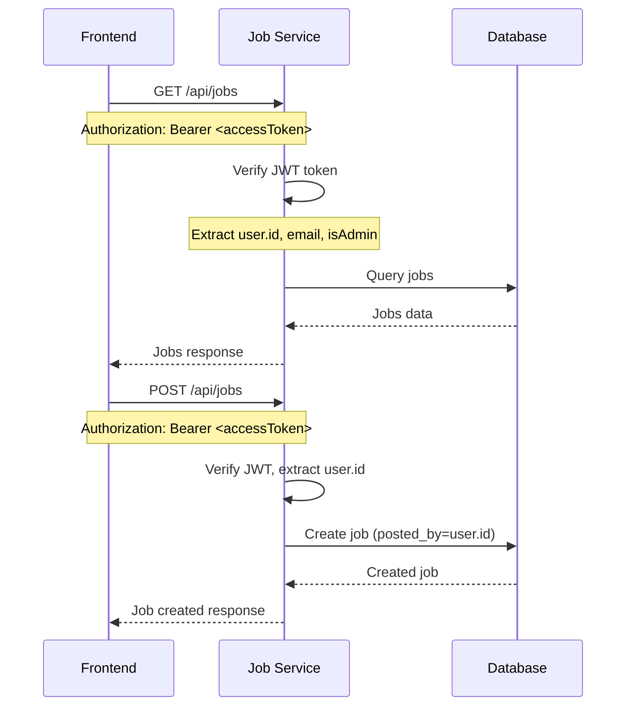
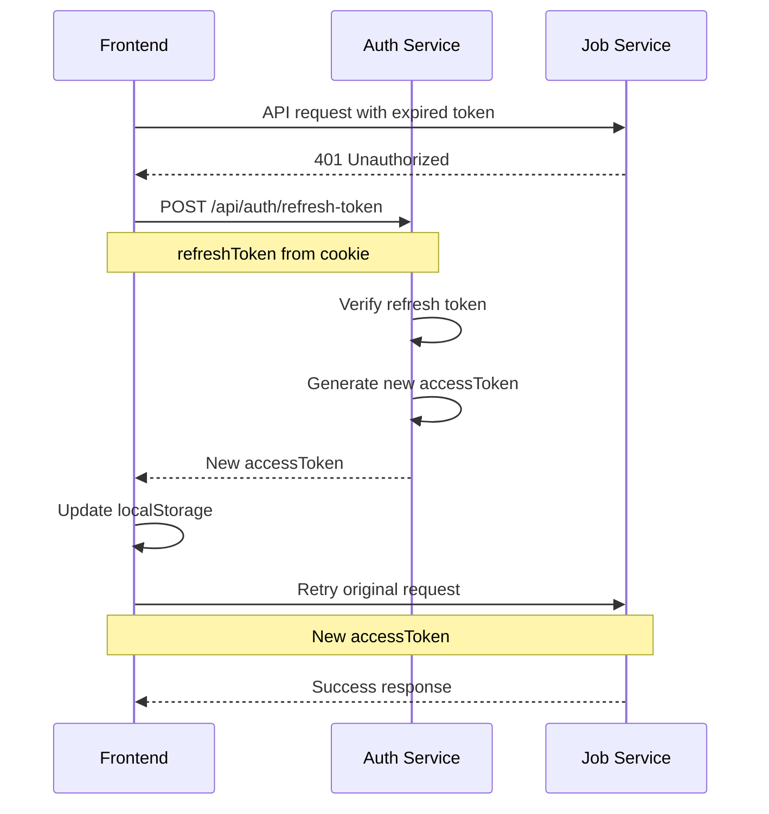

# JWT Exchange Flow Between Services

This document explains how JWT tokens are exchanged between the auth-service and job-service after successful login.

## 🔄 **Complete JWT Flow**

### **1. Login Process**



### **2. Service-to-Service Communication**



### **3. Token Refresh Flow**



## 🔧 **Technical Implementation**

### **JWT Token Structure**

```javascript
// Access Token Payload
{
  "id": "user-uuid",
  "email": "user@example.com",
  "firstName": "John",
  "lastName": "Doe",
  "isAdmin": false,
  "iat": 1640995200,
  "exp": 1640996100
}

// Refresh Token Payload
{
  "id": "user-uuid",
  "type": "refresh",
  "iat": 1640995200,
  "exp": 1641600000
}
```

### **Environment Variables**

Both services must share the same JWT configuration:

```env
# Auth Service & Job Service
JWT_SECRET=your_shared_jwt_secret_here
JWT_ACCESS_EXPIRY=15m
JWT_REFRESH_EXPIRY=7d
```

### **Frontend Token Management**

```javascript
// Automatic token inclusion in requests
api.interceptors.request.use((config) => {
  const token = localStorage.getItem('accessToken');
  if (token) {
    config.headers['Authorization'] = `Bearer ${token}`;
  }
  return config;
});

// Automatic token refresh on 401
api.interceptors.response.use(
  (response) => response,
  async (error) => {
    if (error.response?.status === 401) {
      // Attempt token refresh
      const newToken = await refreshToken();
      // Retry original request
    }
  }
);
```

## 🛡️ **Security Considerations**

### **Token Storage**
- ✅ **Access Token**: Stored in localStorage (for API calls)
- ✅ **Refresh Token**: Stored in httpOnly cookie (secure)
- ❌ **Never store tokens in sessionStorage** (cleared on tab close)

### **Token Validation**
- ✅ **Signature verification** using shared secret
- ✅ **Expiration checking** (automatic by JWT library)
- ✅ **Token type validation** (access vs refresh)
- ✅ **User existence verification** (on refresh)

### **CORS Configuration**
```javascript
app.use(cors({
  origin: process.env.CORS_ORIGIN || 'http://localhost:3000',
  credentials: true, // Required for cookies
}));
```

## 🔄 **Service Communication Patterns**

### **1. Direct Token Passing**
```javascript
// Frontend makes direct calls to job-service
const response = await api.get('/api/jobs');
```

### **2. Service-to-Service (Future Enhancement)**
```javascript
// Auth service could validate tokens for other services
const validateToken = async (token) => {
  return jwt.verify(token, JWT_SECRET);
};
```

### **3. API Gateway Pattern (Current Setup)**
```nginx
# nginx.conf routes requests to appropriate services
location /api/auth/ {
    proxy_pass http://auth-service:4001;
}

location /api/jobs/ {
    proxy_pass http://job-service:4002;
}
```

## 🚀 **Best Practices**

### **1. Token Lifecycle**
- **Access Token**: 15 minutes (short-lived for security)
- **Refresh Token**: 7 days (longer-lived for convenience)
- **Automatic refresh**: Before expiration

### **2. Error Handling**
```javascript
// Handle different JWT errors
if (error.name === 'TokenExpiredError') {
  // Attempt refresh
} else if (error.name === 'JsonWebTokenError') {
  // Invalid token, redirect to login
}
```

### **3. Logout Process**
```javascript
// Clear all tokens
localStorage.removeItem('accessToken');
// Clear refresh token cookie (handled by auth service)
await api.post('/api/auth/logout');
```

## 🔍 **Debugging JWT Issues**

### **Common Problems**

1. **"Invalid token" errors**
   - Check JWT_SECRET is the same across services
   - Verify token format (Bearer <token>)

2. **"Token expired" errors**
   - Check if refresh flow is working
   - Verify token expiration times

3. **CORS issues**
   - Ensure credentials: true is set
   - Check CORS_ORIGIN configuration

### **Debugging Tools**
```javascript
// Decode JWT without verification (for debugging)
const decoded = jwt.decode(token, { complete: true });
console.log('Token payload:', decoded.payload);
```

## 📝 **Testing the Flow**

### **1. Test Login**
```bash
curl -X POST http://localhost:8080/api/auth/login \
  -H "Content-Type: application/json" \
  -d '{"email":"test@example.com","password":"password"}'
```

### **2. Test Job Service with Token**
```bash
curl -X GET http://localhost:8080/api/jobs \
  -H "Authorization: Bearer YOUR_ACCESS_TOKEN"
```

### **3. Test Token Refresh**
```bash
curl -X POST http://localhost:8080/api/auth/refresh-token \
  -H "Cookie: refreshToken=YOUR_REFRESH_TOKEN"
```

This JWT flow ensures secure, stateless authentication across your microservices while providing a smooth user experience with automatic token refresh. 